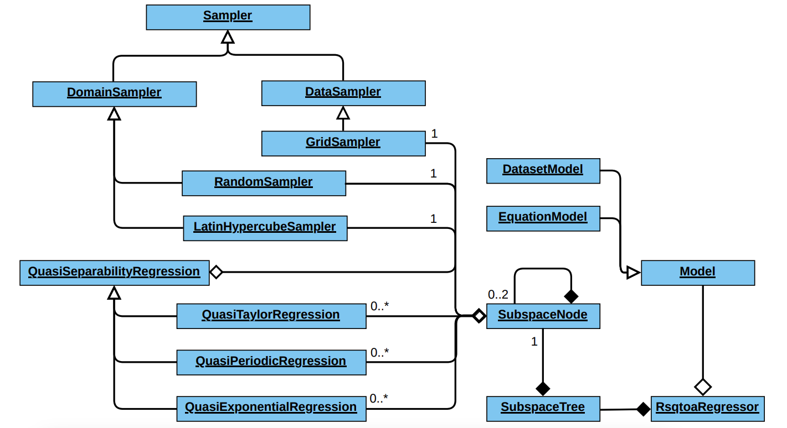

# **RSQTOA**

**RSQTAO** (**R**andomized **S**ubspace **Q**uasi **T**aylor **O**rder **A**nalysis)



## Background

### Framework

The Randomized Subspace Quasi Taylor-Order Analysis (RSQTOA) framework is a novel approach that addresses the challenge
of high-dimensional regression modeling by reducing the dimensionality of multivariate scalar functions. The framework
employs the concept of "Quasi-Separability" to identify dimensions that can be approximated independently of the rest.
It combines this technique with machine learning algorithms, such as Artificial Neural Networks, to approximate the
non-separable dimensions. By reducing the dimensionality of the problem, the RSQTOA framework improves computational
efficiency and reduces the time and resources required for modeling. It provides a flexible and robust method for
developing surrogate models that accurately represent complex relationships between input features and the target
variable

The framework comprises three primary components: the sampling, the Quasi-Separability detection, and the subdomain
splitting. The framework adopts an automatic approach that partitions the domain into smaller subdomains and identifies
subspaces that exhibit _Quasi-Separability_. To accomplish this task, a tree-based structure is utilized to traverse the
domain. To fit or represent a dimension using an approximate model, the framework relies on the Quasi-Separability
regressor. Consequently, the framework depends on sampling to obtain a representative sample that can help the regressor 
identify the underlying structure and relationships between the feature and target variables. For more detailed
description of frameworks implementation and background please refer to [Simon L. Märtens, 2022].

### Compatibility with Datasets

In order to extend the capabilities of the RSQTOA framework, which focuses on producing approximate models for
multivariate scalar functions, we conduct a consequent research aimed to enhance the framework’s compatibility with 
generating approximate models using datasets. The current framework operates on functions as input, where scalar 
regressions for each dimension are obtained through domain and dimension sampling. This process involves acquiring target 
values from the function, performing regressions, and validating the error against predefined criteria. However, when 
dealing with datasets instead of actual functions, we face the challenge of having limited data points available. To 
overcome this challenge, two approaches are proposed. Firstly, we suggest representing the dataset in a functional form 
using interpolators, which can then be utilized as input to the framework. Secondly, we introduce a multidimensional 
grid-based sampling approach to address the limitations posed by the dataset.

Consequently, a comparative analysis was conducted to evaluate the performance of the RSQTOA framework with
interpolation and grid sampling approaches, in comparison to Artificial Neural Networks (ANNs) as baseline models. This
evaluation aimed to assess the effectiveness of the proposed framework in various scenarios. Two [experiments] were utilized
for this purpose. Firstly, a [Synthetic Dataset] was generated using a simple mathematical function, enabling a controlled
environment for evaluating the performance of the RSQTOA-based approaches. Additionally, the [Yelp Dataset] was
employed, which encompassed diverse features related to review content, reviewer characteristics, and business
attributes. The comparative analysis of these datasets allowed for a comprehensive evaluation of the RSQTOA framework,
providing valuable insights into its performance, accuracy, and scalability in different contexts. The findings from
this analysis contribute to a better understanding of the advantages and limitations of the framework compared to
traditional ANN-based models. For more detailed description of frameworks implementation and background please refer to 
[Ashish Rajani, 2023].

## Dependencies:

The framework is compatible with `python 3.7`. Furthermore, for the dependencies please refer to [requirements.txt]. In
order to install dependencies. Create and activate a new virtual environment if needed and execute the following command: 


```
pip3 install -r requirements.txt
```

## Usage

For detailed description and usage guidance please refer to [experiments]. The code published with the experiments
provide a good idea of how the framework in different settings can be used. Its worth noting that the framework  is 
still under development, please refer to the detailed report by [Simon L. Märtens, 2022] and [Ashish Rajani, 2023].

[Simon L. Märtens, 2022]: /report/01_RSQTOA_Framework_Simon_Maertens.pdf
[Ashish Rajani, 2023]: /report/02_RSQTOA_Framework_Dataset_Adoption_Ashish_Rajani.pdf
[experiments]: /experiments/README.md
[Synthetic Dataset]: /experiments/synthetic/README.md
[Yelp Dataset]: /experiments/yelp/README.md
[requirements.txt]: requirements.txt