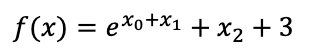

# **Synthetic Data**

In the current experiment we aim to evaluate the performance of RSQTOA framework
with a synthetic dataset. More specifically, we used below equation to generate the Dataset defined as



## Usage

The present directory consist of two folders i.e. `data` and `models`. Where the
`data` folder consists of all the necessary information and procedure followed
build the final features that we end up using to build our regressors. And `model`
folder consists of all the models trained during the experiment with the results
that were obtained.

### Data

The folder structure of `data` folder is as follows:

```
data
│
│───data.csv
└───generator.py
```

The above diagram gives a rough overview of the `data` folder's structure. It consists of two files, the purpose and use 
of both the files are described below:

- **[generator.py]**: is a python script which we used to generate the synthetic dataset using the equation described 
above. For the generation we sample 10000 random samples for each of our input variable and used the above equation to 
generate the output
- **[data.csv]**: Final curated data that we intend to use for our experiments.

### Models

The folder structure of `models` folder is as follows:

```
models
│   
│───ann
│   │ 
│   │───logs
│   │───results.csv
│   └───runner.py 
│
│───elasticnet
│   │ 
│   │───hyperparameter_search.ipynb 
│   │───logs
│   │───results.csv
│   └───runner.py 
│
│───grid
│   │ 
│   │───config.yml
│   │───logs
│   │───loss_hist_*.csv
│   │───results.csv
│   └───runner.py 
│
│───interpolator
│   │ 
│   │───config.yml
│   │───logs
│   │───loss_hist_*.csv
│   │───results.csv
│   └───runner.py 
│
│───linear_regression
│   │ 
│   │───logs
│   │───results.csv
│   └───runner.py
│ 
│───plots.ipynb
└───... generated images from plots.ipynb

```

The above diagram gives a rough overview of the `models` folder structure. The directory consists of all the different 
approaches we tried to build the regressor to predict the target variable. The subdirectories `grid` and `interpolator` 
consists of RSQTOA backed approaches. For each model 20-Fold cross validation was performed. Hence, the `runner.py` 
is designed in such a way. Furthermore, these `runner.py` can also be served as a usage examples/demonstration of how to 
use the framework with proposed `Grid Sampling` and `Data Approximation` approaches such as `interpolation`.

Each model folder consists of some additional files the purpose of each of them are described below:

- **[ann]**: The folder demonstrate the use of Artificial Neural Network (ANN) for building a regressor to predict
the target variable. The `logs` and `results.csv` file consists of logs and performance metrics obtained during 20-Fold
cross validation that was performed.
- **[elasticnet]**: The folder demonstrate the use of ElasticNet for building a regressor to predict the target variable. 
The `logs` and `results.csv` file consists of logs and performance metrics obtained during 20-Fold cross validation 
that was performed. Lastly, `hyperparameter_search.ipynb` consists of steps that were takes to come up with the 
optimal hyperparameters for ElasticNet to solve the problem at hand.
- **[grid]**: The folder demonstrate the use of RSQTOA Framework with the proposed Grid Sampling algorithm for building 
a regressor to predict the target variable. The `logs` and `results.csv` file consists of logs and performance metrics 
obtained during 20-Fold cross validation that was performed. Lastly, `config.yml` consists of the hyperparameters that
were used for the RSQTOA framework and `loss_hist_*.csv` consists of the loss history that was observed for each fold 
along 100 epochs.
- **[interpolator]**: The folder demonstrate the use of RSQTOA Framework with the Nearest Neighbour Interpolator for 
building a regressor to predict the target variable. The `logs` and `results.csv` file consists of logs and performance 
metrics obtained during 20-Fold cross validation that was performed. Lastly, `config.yml` consists of the hyperparameters 
that were used for the RSQTOA framework and `loss_hist_*.csv` consists of the loss history that was observed for each 
fold along 100 epochs.
- **[linear_regression]**: The folder demonstrate the use of Ordinary Least Square for building a regressor to predict
the target variable. The `logs` and `results.csv` file consists of logs and performance metrics obtained during 20-Fold 
cross validation that was performed.


**[plots.ipynb]** Is a notebook which accumulates the results obtained from building different models and plots the 
comparative performance scores. 


[generator.py]: data/generator.py
[data.csv]: data/data.csv
[ann]: models/ann
[elasticnet]: models/elasticnet
[grid]: models/grid
[interpolator]: models/interpolator
[linear_regression]: models/linear_regression
[plots.ipynb]: models/plots.ipynb
